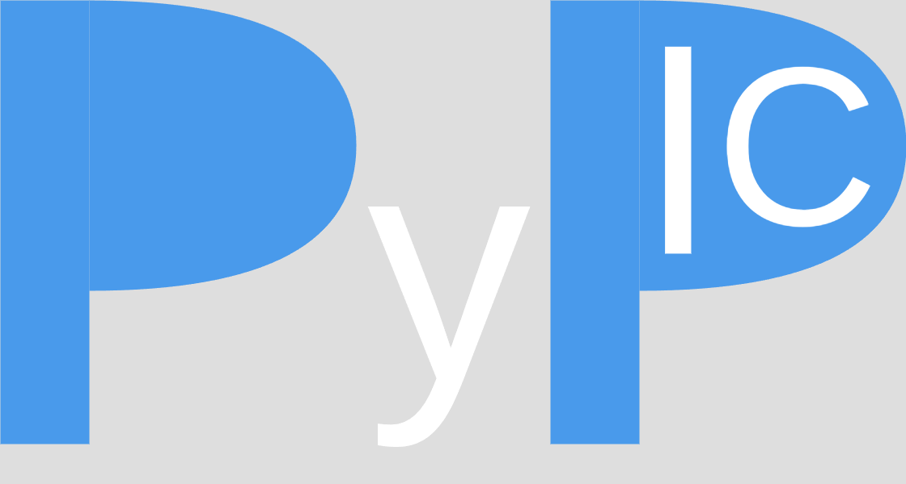

<div align="center">
  
</div>

## PyPIC3D

PyPIC3D is a 3D particle-in-cell (PIC) plasma simulation code written in Python with JAX.
It is built around a config-driven CLI workflow:

```bash
PyPIC3D --config path/to/config.toml
```

## What It Does

- Advances charged particle species with a Boris particle pusher.
- Deposits current with either `j_from_rhov` or `esirkepov`.
- Evolves fields with a first-order Yee electrodynamic update or an electrostatic Poisson solve.
- Writes diagnostics, VTK outputs, and optional openPMD files.

## Installation

From PyPI:

```bash
pip install PyPIC3D
```

From source:

```bash
git clone <repo-url>
cd PyPIC3D
pip install .
```

For development:

```bash
pip install -e .
```

## Quick Start

Run a packaged demo from the repository root:

```bash
PyPIC3D --config demos/two_stream/two_stream.toml
```

Simulation outputs are written to `<output_dir>/data` (default: current working directory).

## Documentation Map

Primary docs live in `docs/` (Sphinx + reStructuredText):

- `docs/index.rst`: doc entry point and navigation.
- `docs/usage.rst`: runtime configuration and CLI behavior.
- `docs/solvers.rst`: electrodynamic/electrostatic update paths.
- `docs/chargeconservation.rst`: current deposition methods.
- `docs/grid.rst`: grid layouts and boundary model.
- `docs/particles.rst`: species model and initialization.
- `docs/demos.rst`: demo catalog and run commands.
- `docs/architecture.rst`: module-level architecture and data flow.
- `docs/development.rst`: setup, tests, docs build, debugging notes.
- `docs/contributing.rst`: contribution workflow.

## Repository Layout

```text
PyPIC3D/
  __main__.py              # CLI entrypoint
  initialization.py        # config/defaults + world/fields/particles setup
  evolve.py                # per-step simulation loops
  particle.py              # particle species model + initialization
  J.py                     # current deposition methods
  rho.py                   # charge deposition
  solvers/                 # field solvers and operators
  diagnostics/             # plotting, VTK, openPMD writers
  utils.py                 # config, IO, helper math/utilities

demos/                     # runnable example configurations
tests/                     # pytest suite
```

## Testing

```bash
pytest
```

## Build Docs

```bash
pip install -r docs/requirements.in
sphinx-build -b html docs docs/_build/html
```

## License

MIT. See `LICENSE`.
