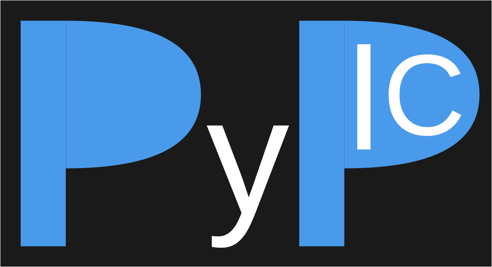

<div align="center">
    
</div>

## PyPIC3D

PyPIC3D is a 3D particle-in-cell (PIC) simulation code developed in Python, leveraging the Jax library for high-performance numerical computing. The primary goal of this project is to explore the feasibility of using Python and Jax for plasma simulations, which are traditionally performed using languages like C++ and Fortran.

### Key Features

- **JAX acceleration**: Leverages JAX for high-performance numerical kernels and JIT compilation.
- **Multiple solvers**: Supports FDTD, PSTD (spectral), vector potential, curl-curl, and electrostatic workflows.
- **Config-driven runs**: Simulations are configured via TOML files and executed with a single CLI command.

### Applications

PyPIC3D can be used for various plasma simulation applications, including but not limited to:

- **Stellarator Simulations**: Investigating the behavior of plasma in stellarator devices, which are used in fusion research.
- **Optimization**: Utilizing autodifferentiation for optimizing plasma configurations and parameters.
- **Surrogate Modeling**: Creating surrogate models to approximate plasma behavior, reducing computational costs for large-scale simulations.

### Installation
PyPIC3D can be install from the PyPI repository using PIP by running the following command:

```bash
    pip install PyPIC3D
```

PyPIC3D can also be installed from source by cloning the repository and running the following:
```bash
    cd PyPIC3D
    pip install .
```

### Getting Started
To get started with PyPIC3D, follow the instructions in the read the docs to create a configuration file
or use an existing demo.

To run PyPIC3D on a configuration file, run the following command:

```bash
PyPIC3D --config filename.toml
```

### Code Structure

The PyPIC3D codebase is organized into several key sections:

- **Core**: Core PIC functionality including particle push, field solvers, and diagnostics.
- **Demos**: Example configurations for common plasma phenomena and regression tests.
- **Tests**: Unit and integration tests that validate the simulation components.

Each section is designed to be modular and easily extensible, allowing users to customize and expand the functionality of PyPIC3D according to their needs.

### Contributing

Contributions to PyPIC3D are welcome. Please refer to the contributing guidelines in the repository for more information on how to contribute.

### License

This project is licensed under the MIT License. See the LICENSE file for details.
