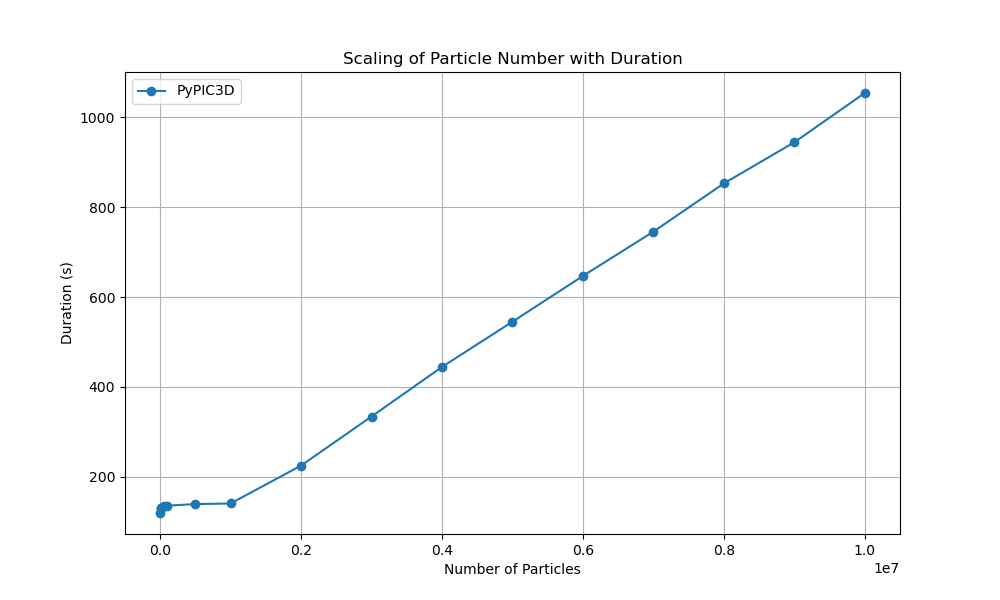

Computational Experiments
===============================
PyPIC3D provides a framework for managing and executing computational experiments. The `Experiments` class is designed to execute
individual computational experiments using the `epyc` framework. It provides a structured way to define, run, and analyze experiments. 
The `ParameterScan` class is designed to perform parameter scans over a range of values for computational experiments. It leverages the `epyc` framework to systematically vary parameters and collect results.

Usage
-----

To use the ParameterScan class, you need to create an instance of the ParameterScan class and provide the necessary parameters. Here is an example of how you might use the ParameterScan class to perform a parameter scan:

.. code-block:: python

    base_config = toml.load(config_file)

    # Define the parameter scan
    param_scan = ParameterScan(
        name="particle_scaling_experiment",
        run_dir="particle_scaling",
        base_config=base_config,
        section="particle1",
        param_name="N_particles",
        param_values=[1000, 5000, 10000, 50000, 100000, 500000, 1000000, 2000000, 3000000, 4000000, 5000000, 6000000, 7000000, 8000000, 9000000, 10000000]
    )

    parameters = param_scan.parameters()
    durations = []
    values    = []

    # Run the experiment
    for parameter, value in parameters:
        experiment = param_scan.build(parameter)
        results = experiment.run()
        # get the results of the experiment
        durations.append(results["duration"])
        # log the time taken for each experiment
        values.append(value)
        # log the values of the parameter

    with open("particle_scaling/durations.txt", "w") as f:
        for value, duration in zip(values, durations):
            f.write(f"{value} {duration}\n")

The example above was used to perform a particle scaling experiment with PyPIC3D to analyze
its performance for large numbers of particles. The experiment was conducted on a electron species
contained within a 0.1m x 0.1m x 0.1m domain. The experiment was run on a single node with 1 core.

This experiment will be compared to results from OSIRIS, an open source PIC code developed by UCLA.