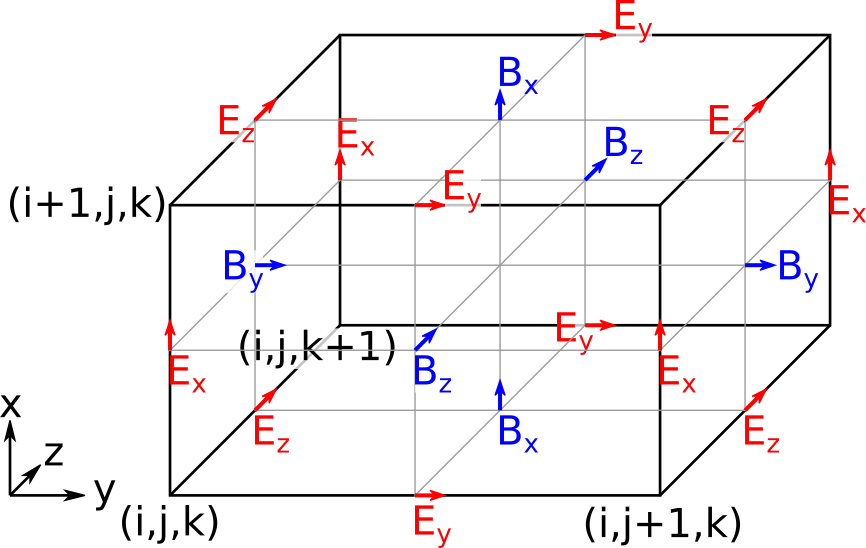

Simulation Grids
================

PyPIC3D builds structured 3D grids during initialization and stores them in
``world['grids']``.

Grid Construction
-----------------

By default, initialization builds a Yee-style pair of grids:

- ``world['grids']['vertex']``: grid used for electric-field alignment
- ``world['grids']['center']``: staggered grid used for magnetic-field
  alignment

These are generated from ``Nx, Ny, Nz`` and ``x_wind, y_wind, z_wind``.

Boundary Encoding
-----------------

Field boundary conditions are stored in
``world['boundary_conditions']`` as integer codes for JAX-safe usage:

- ``0``: periodic
- ``1``: conducting

Dimensionality Handling
-----------------------

PyPIC3D supports effectively 1D/2D/3D runs by setting inactive dimensions to a
single cell (for example ``Ny = 1``). Deposition and solver routines infer
active dimensions from array shapes.
